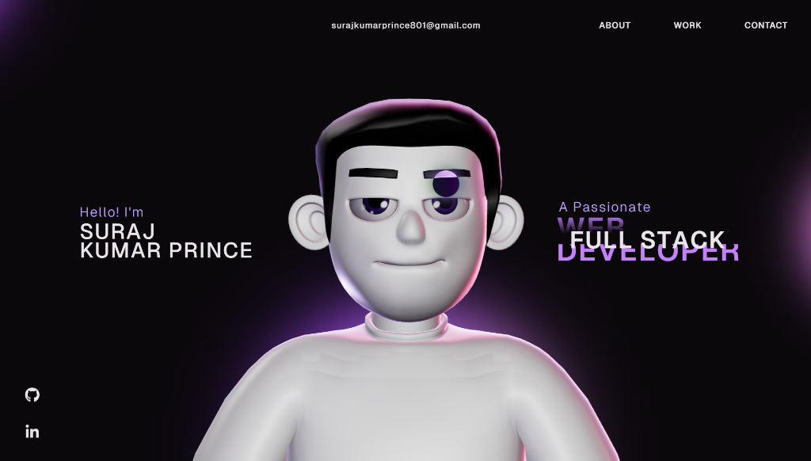
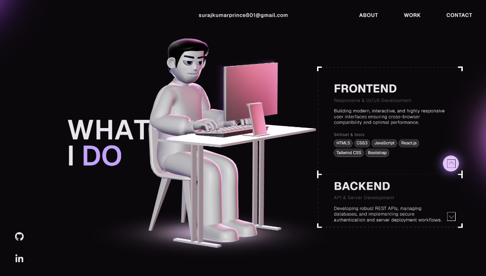

# Suraj Kumar Prince - Personal Portfolio

Welcome to the repository for my personal portfolio website! This modern, interactive website was built to showcase my skills, projects, and professional experience as a Full Stack Web Developer.

### 🌐 Live Website
Check out the live version here: [https://portfolio-git-main-princekr801s-projects.vercel.app](https://portfolio-git-main-princekr801s-projects.vercel.app)

---

## 🚀 Features & Details

- **Modern & Interactive UI:** Smooth scrolling and rich, premium animations powered by GSAP.
- **Dynamic Projects Section:** Highlighting my core work including:
  - **Judicial Helpdesk System:** A full-stack legal assistance dashboard.
  - **AI Healthcare Predictor:** A machine learning driven symptom analysis tool.
  - **Smart Portfolio Website:** This very website, featuring 3D elements and smooth transitions.
  - **Real-Time Chat App:** A seamless communication application built with Socket.io.
- **Professional Timeline:** A detailed look at my career history and internships at CodeAlpha and Pinnacle Labs.
- **Fully Responsive:** Carefully crafted to look perfect on desktop, tablet, and mobile devices.

## 🛠️ Technology Stack

- **Frontend:** React.js, TypeScript, Vite
- **Styling:** Tailwind CSS, Custom Vanilla CSS
- **Animations:** GSAP (ScrollTrigger, SplitText, ScrollSmoother)
- **Deployment:** Vercel

---

## ⚠️ Copyright & Usage Notice

**© 2026 Suraj Kumar Prince. All Rights Reserved.**

This repository is open for **showcasing and learning purposes**. 
You are very welcome to explore the code to learn from my development practices and animations. However, please do not directly clone or reuse this exact personal portfolio design for yourself.

If you are trying to build your own portfolio and get stuck on a specific feature or animation, please feel free to reach out to me—I'd be happy to help!

---

## 📬 Contact
- **Email:** surajkumarprince801@gmail.com
- **LinkedIn:** [Suraj Kumar Prince](https://www.linkedin.com/in/suraj-kumar-prince-423821227)
- **GitHub:** [Princekr801](https://github.com/Princekr801)
